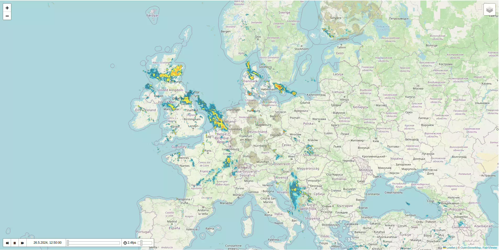

## Leaflet.TimeDimension.Rainviewer

Add Rain Radar and Satellite Images from [RainViewer](https://www.rainviewer.com/) to a [Leaflet](https://leafletjs.com) Map using [Leaflet TimeDimension](https://github.com/socib/Leaflet.TimeDimension).

The implementation is largely based on the [Leaflet TimeDimension Portus Example](https://github.com/socib/Leaflet.TimeDimension/blob/master/examples/js/extras/leaflet.timedimension.tilelayer.portus.js).

See [demo.html](https://krausmatthias.github.io/Leaflet.TimeDimension.Rainviewer/demo.html) for a minimal demo.
